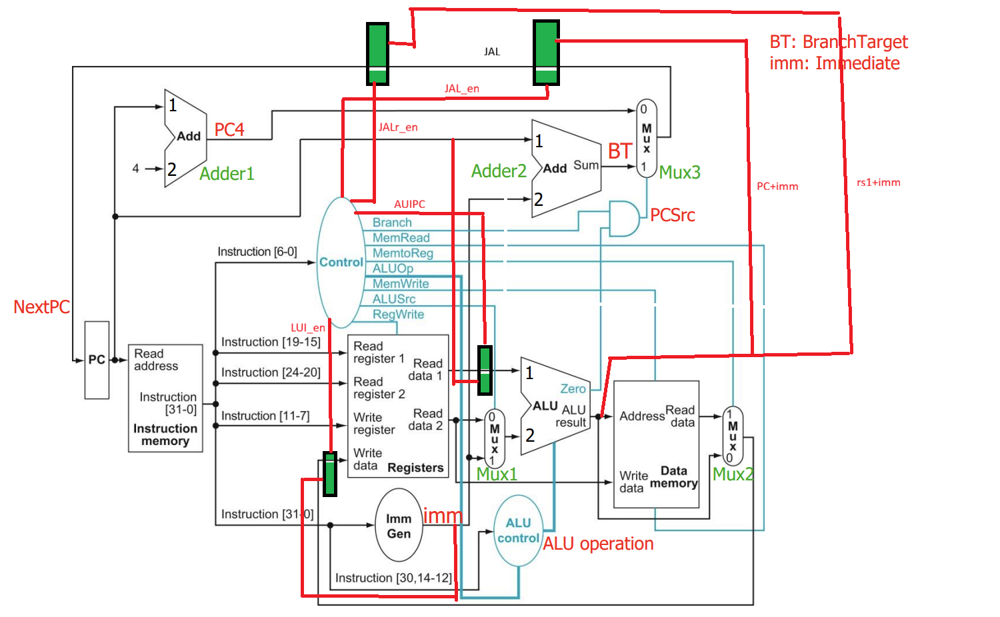

Perfect, Jeeva 🚀 This is exactly the right time to document your project properly and make a solid GitHub README that looks professional. I’ll draft a **structured README report** for your RISC-V CPU project, covering everything:

---

# 🖥️ RISC-V Single Cycle CPU

This repository contains the implementation of a **Single Cycle RISC-V CPU**, designed and simulated in Verilog. The CPU supports a subset of the RISC-V RV32I instruction set architecture (ISA), along with a basic memory system and test programs executed through pre-loaded hex files.

---

## 📌 Project Overview

* **ISA**: RISC-V RV32I (subset)
* **Architecture**: Single cycle (all operations complete in one clock cycle)
* **Design Flow**: Verilog HDL → Simulation with testbench → Waveform verification
* **Memory Initialization**: Instructions/data pre-loaded using `$readmemh`

---



## 🏗️ CPU Components

### 1. **Datapath Blocks**

* **Program Counter (PC)**: Holds the current instruction address. Updated sequentially or by branch/jump.
* **Instruction Memory**: Stores instructions, loaded from `.hex` file.
* **Register File**: 32 general-purpose registers (x0–x31). Supports 2 read ports and 1 write port.
* **ALU (Arithmetic Logic Unit)**: Performs arithmetic/logic ops based on ALUOp control signal.
* **Data Memory**: For load/store instructions.
* **Immediate Generator**: Extracts and sign-extends immediates from instruction formats.
* **MUXes**: Select inputs for ALU, PC update, register write data.

### 2. **Control Unit**

Generates control signals based on the opcode.

Control signals used:

* **ALUSrc** – Selects between register/imm as ALU input.
* **MemtoReg** – Selects ALU result or memory data for register writeback.
* **RegWrite** – Enables writing to register file.
* **MemRead** – Enables data memory read.
* **MemWrite** – Enables data memory write.
* **Branch** – Used with ALU Zero flag for conditional branching.
* **JAL_en** – Enables jump (JAL).
* **JALR_en** – Enables register-based jump (JALR).
* **AUIPC_en** – Enables AUIPC update.
* **LUI_en** – Enables LUI operation.
* **ALUOp[2:0]** – Encodes operation for ALU.

---

## 🧮 Supported Instructions

### ✔️ Arithmetic / Logic

* **ADD, SUB**
* **AND, OR, XOR**
* **SLT (set less than)**

### ✔️ Memory

* **LW** (load word)
* **SW** (store word)

### ✔️ Branches

* **BEQ** (branch equal)

### ✔️ Jumps & Upper Immediates

* **LUI** – Load Upper Immediate (`rd = imm << 12`)
* **AUIPC** – Add Upper Immediate to PC (`rd = PC + imm << 12`)
* **JAL** – Jump and Link (`PC = PC + imm`)
* **JALR** – Jump and Link Register (`PC = (rs1 + imm) & ~1`)

.png)

## ⚡ ALU Operations

| ALUOp | Operation |
| ----- | --------- |
| 000   | ADD       |
| 001   | SUB       |
| 010   | AND       |
| 011   | OR        |
| 100   | XOR       |
| 101   | SLT       |

---

## 📂 File Structure

```
/cpu-project
│── src/
│   ├── alu.v
│   ├── regfile.v
│   ├── control.v
│   ├── imm_gen.v
│   ├── pc.v
│   ├── cpu_top.v
│── tb/
│   ├── cpu_tb.v
│   └── program.hex
│── docs/
│   └── README.md
```

---

## 🧪 Test Programs

### Example: Arithmetic + Branch Test

```
@00000000
00500093   // addi x1, x0, 5
00A00113   // addi x2, x0, 10
002081B3   // add  x3, x1, x2
40110233   // sub  x4, x2, x1
00302023   // sw   x3, 0(x0)
00002283   // lw   x5, 0(x0)
FE529CE3   // beq  x5, x2, -8
```

### Example: Jump + Upper Immediates Test

```
000002B7   // lui   x5, 0x00000
00000297   // auipc x5, 0x00000
004000EF   // jal   x1, 4
00008067   // jalr  x0, 0(x1)
```

---

## 📊 Simulation & Verification

* **Waveform inspection**: PC updates, register writes, memory accesses.
* **$monitor** in TB shows real-time register/memory changes.
* Verified with both **hand-written test programs** and **compiled C programs** (`hello.c → .elf → .hex`).

---

## ✅ Results

* Correct execution of arithmetic, memory, branch, and jump instructions.
* Verified **C program execution** (`reg10 = 15` as expected).
* Demonstrated single cycle datapath correctness.

.png)

---

## 🚀 Future Work

* Extend instruction set (full RV32I).
* Add **pipelining** with hazard detection.
* Support for **multiplication/division (RV32M)**.
* Exception/interrupt handling.

---

## 📝 Author

👤 **Jeevanandh R**

* VLSI & Embedded Systems Enthusiast
* Exploring **RTL design, verification, and CPU architecture**

---
